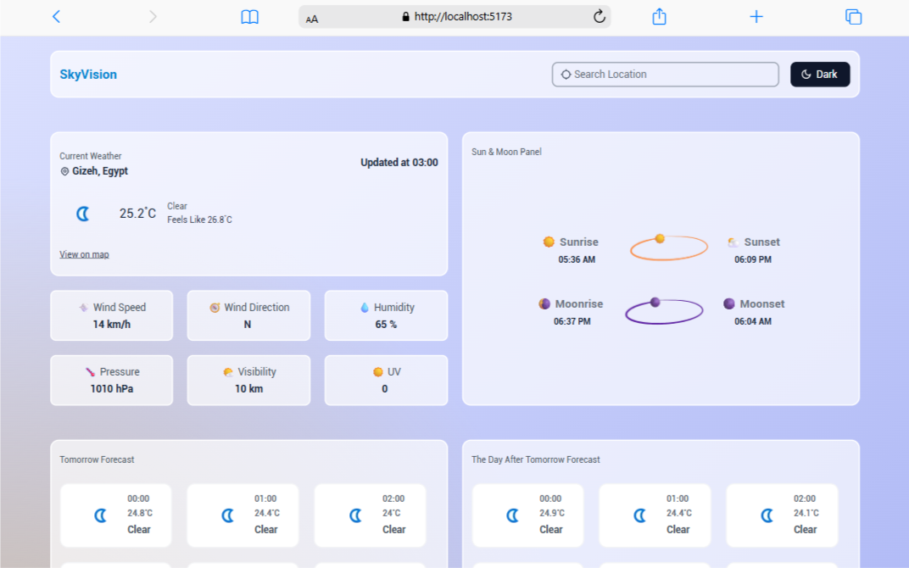

# SkyVision 🌤️

SkyVision is a modern **React + TypeScript** weather application that provides **real-time weather updates**, **3-day forecasts**, **sun & moon details**, and **geolocation-based weather detection**.  
Built with a **responsive UI** for a seamless experience across devices.

---

## 🚀 Features
- 🌍 **Geolocation support**: detect user’s location automatically or search manually.
- 🌡️ **Live weather updates**: temperature, humidity, wind speed, pressure, UV index, and more.
- 📅 **3-day weather forecast** with hourly breakdown.
- ☀️🌙 **Sun & Moon info**: sunrise, sunset, moonrise, and moonset.
- 📱 **Fully responsive design** for mobile, tablet, and desktop.
- 🌗 **Light & Dark Mode** toggle for better user experience.
- ⚡ Built with **React, TypeScript, TailwindCSS**, and **Axios**.

---

## 🛠️ Tech Stack
- **Framework & Language:** React 19 + TypeScript  
- **Styling:** Tailwind CSS  
- **Data Fetching:** Axios  
- **State Management:** React Context API  
- **Notifications:** React Hot Toast  
- **Icons:** React Icons  
- **Weather Data Provider:** WeatherAPI
---

## 🚀 Live Demo
Check out the live demo here 👉 [SkyVision on Netlify](https://skyvision-app.netlify.app/)

---

## 📸 Screenshots
### 🌞 Light Mode


### 🌙 Dark Mode


---

## 📂 Project Setup

```bash
# Clone the repo
git clone <your-repo-link>

# Navigate to project folder
cd skyVision

# Install dependencies
npm install

# Start development server
npm run dev
